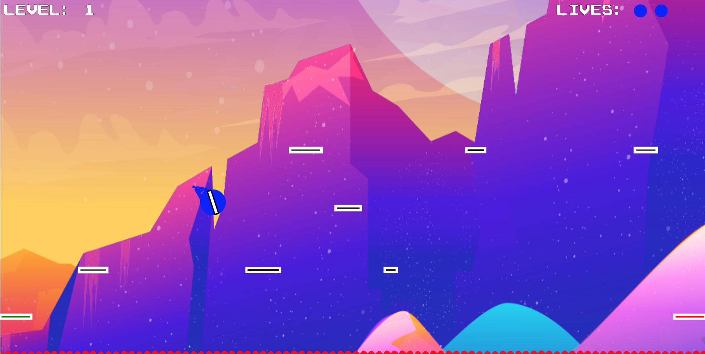

# Retro Arcade Page

<h3 align="center">Arcade Page Project, 3-28-2021</h3>
<h4 align="center"> By Harrison Strand & Garrett Brown</h4>

## Main Description

This project is designed as a arcade game portal for Hubb as part of the virtual event space product. Users can navigate to the arcade main page and choose which game to play to take a break from their company webinars in the virtual space. This project was created with Angular and Typescript with use of p5.js library and Figma and CSS for front end design.

 

<h1 align="center"> MAIN PAGE</h1>
<h2 align="center"> Authors:</h2>
<h4 align="center"> Harrison Strand & Garrett Brown</h4>
 

### Description

This HTML page was designed with Figma and implimented with CSS front end design and gives users the ability to navigate to a game of their choosing using the play buttons as routes to the game title pages.

 
 

### Main Menu

 
 

<h1 align="center"> SNAKE EATER</h4>
<h2 align="center"> Authors:</h2>
<h4 align="center"> Harrison Strand & Garrett Brown</h4>
 

### Description

This game was designed as a combination of the classic game snake and pac-man with the addition of obstacles to avoid during gameplay. Using vector creation and framerate from p5.js library in combination with custom algorithms for game physics and gameplay, users navigate through the game using the arrow keys and progress through levels, gaining speed across coordinates while collecting points.
 
 

### Title Menu

 
 

### Gameplay

 
 

### Physics Example

 
 

<h1 align="center"> BOB</h1>
<h2 align="center"> Author:</h2>
<h4 align="center"> Harrison Strand</h4>
 

### Description

This game was designed as a simple platform jumper game that scrolls left to right. Using vector creation and framerate from p5.js library in combination with custom algorithms for game physics, collision detection, and design movement, users navigate through the game using the arrow keys to jump from the starting platform to the final platform befor progressing to the next level. Users can avoid colliding with enemies or the bottom lava, or shoot enemies to avoid losing lives.
 
 

### Title Menu

 
 

### Gameplay

 
 

### Physics Example

 
 

<h1 align="center"> VEKTOR KOMMANDER</h1>
<h2 align="center"> Author:</h2>
<h4 align="center"> Grant Eadie & Ben Stoller</h4>
 

### Description

This game was designed to be similar to the gameplay and progression of the classic game; Asteroids. Users can navigate the ship and shoot using the arrow keys and spacebar to destroy obstacles in the path of the player. Using p5.js library and custom algorithms for actions and level progression, this game uses retro style vector rendering and minimalistic design.

 
 

### Title Menu

<!--  -->
 
 

### Gameplay

<!--  -->
 
 

### Physics Example

<!--  -->
 
 

## User Stories

  
Expand

| ID   | User Story                                                                                | Accepted |
| ---- | ----------------------------------------------------------------------------------------- | -------- |
| US01 | "As a user, I want to be able to see a main page and navigate to a specific game"         | True     |
| US02 | "As a user, I want to be able to progress through levels in each game and collect points" | True     |
| US03 | "As a user, I want to be able to swap colors according to company color scheme"           | True     |

 
 

### MVP

User has the ability to navigate to their desired game. Each game has interchangable variables to impliment client designs for colors and logos with use of JSON files.
 
 

### Tools/Frameworks/Resources

- Angular
- TypeScript
- p5.js Library
- Tone.js
- JavaScript
- HTML
- CSS
- Figma
 
 

### Stretch Goals

- Users have the ability to post high scores
- Users have the ability to play 3 different games
- Users have the ability to play games on hosted site
 
 

## Setup/Installation Requirements

##### Software Requirements

1. Internet browser
2. A code editor such as VSCode to view and edit the code

##### Open Locally

- Click on the link to my repository: [My Repository](https://github.com/HarrisonStrand/template-monster-arcade-feature)
- Click on the green "Code" button and copy the repository URL
- Open your terminal and use the command `git clone ` into the directory you would like to clone the repository
- Open in text editor to view code and make changes

### Required Scripts

In the project directory, run:

### `npm install`

Installs all dependancies for the project in order to run the application

### `npm start`

Runs the app in the development mode.\
Open [http://localhost:4200](http://localhost:4200) to view it in the browser.
Navigate to [http://localhost:4200/arcade-page](http://localhost:4200/arcade-page)

The page will reload if you make edits.\
You will also see any lint errors in the console.

## Available Scripts

### `npm test`

Launches the test runner in the interactive watch mode.\
See the section about [running tests](https://facebook.github.io/create-react-app/docs/running-tests) for more information.

### `npm run build`

Builds the app for production to the `build` folder.\
It correctly bundles React in production mode and optimizes the build for the best performance.

The build is minified and the filenames include the hashes.\
Your app is ready to be deployed!

### `npm run eject`

**Note: this is a one-way operation. Once you `eject`, you can’t go back!**

If you aren’t satisfied with the build tool and configuration choices, you can `eject` at any time. This command will remove the single build dependency from your project.

Instead, it will copy all the configuration files and the transitive dependencies (webpack, Babel, ESLint, etc) right into your project so you have full control over them. All of the commands except `eject` will still work, but they will point to the copied scripts so you can tweak them. At this point you’re on your own.

You don’t have to ever use `eject`. The curated feature set is suitable for small and middle deployments, and you shouldn’t feel obligated to use this feature. However we understand that this tool wouldn’t be useful if you couldn’t customize it when you are ready for it.
 
 

## Learn More

  
Expand

This project was generated with [Angular CLI](https://github.com/angular/angular-cli) version 11.2.6.

## Development server

Run `ng serve` for a dev server. Navigate to `http://localhost:4200/`. The app will automatically reload if you change any of the source files.

## Code scaffolding

Run `ng generate component component-name` to generate a new component. You can also use `ng generate directive|pipe|service|class|guard|interface|enum|module`.

## Build

Run `ng build` to build the project. The build artifacts will be stored in the `dist/` directory. Use the `--prod` flag for a production build.

## Running unit tests

Run `ng test` to execute the unit tests via [Karma](https://karma-runner.github.io).

## Running end-to-end tests

Run `ng e2e` to execute the end-to-end tests via [Protractor](http://www.protractortest.org/).

## Further help

To get more help on the Angular CLI use `ng help` or go check out the [Angular CLI Overview and Command Reference](https://angular.io/cli) page.

## Known Bugs

  - resizing for mobile with BOB
  - tone.js background sounds merge with arcade main page
  - bugs with route navigation without refreshing the DOM

## Support and Contact Details

If any further errors or bugs occur with installation, please email us at, <harrisonstrand@gmail.com> or <gman9mm@live.com>

## Technologies Used

- VSCode
- Node
- Angular
- Typescript
- Javascript
- CSS
- p5.js
- Tone.js
- Figma

### License

This software is licensed under the [MIT License](https://choosealicense.com/licenses/mit/).

Copyright (c) 2021 Harrison Strand & Garrett Brown
